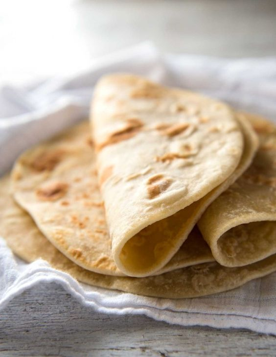

---
image: ../pics/bistrie-lepeshki.jpg
---
# Быстрые лепешки

#### Ингредиенты:

* 130 г йогурта \(или кефира или простокваши или 100 г молока\)
* 130 г муки
* 0,5 ч.л. разрыхлителя
* 1/3 ч.л. соли
* горсть зелени \(опционально\), например, петрушка, шпинат и мята

#### Приготовление:

Смешать аккуратно все ингредиенты и вымесить до однородности, получить нежное липковатое тесто.   
Аккуратно, подпыляя мукой, раскатать скалкой или расплющить пальцами на столе в лепешку и сразу обжарить по несколько минут с каждой стороны на сковороде со сливочным маслом или без масла совсем (получатся суше и без корочки).

*tg: feedthebitch*
