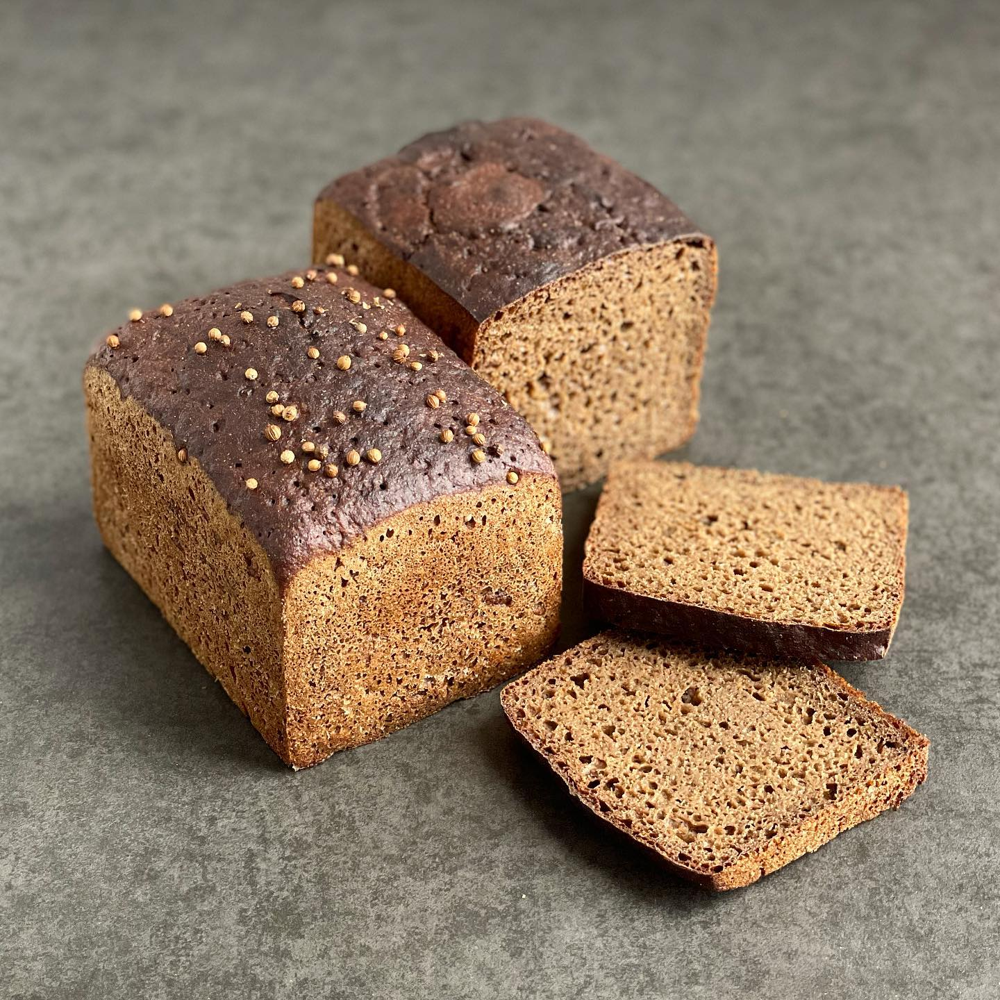

---
image: ../pics/borodinsky.jpg
---
# Бородинский хлеб

#### Ингредиенты

**для опары:**
за 12 часов

* ржаная закваска 15 г
* вода 83 г
* ржаная обдирная мука 83 г

**для заварки:**
за 3 часа

* ферментированной ржаной солод 30 г
* ржаная обдирная мука 11 г
* горячая вода (+ 100 °С) 110 г
* молотый кориандр (тмин) 4 г
* белый неферментированный солод 2-3 г

**для теста:**

* вода 216 г
* закваска (опара) 180 г
* заварка (вся) 180 г
* ржаная обдирная мука 245 г
* мука пшеничная в.с.(или 1 сорта) 80 г
* мед 31 г
* соль 9 г
* кориандр на посыпку

#### Приготовление

Приготовить опару. Соединить закваску, воду и муку. Оставить на 8 -12 часов при комнатной температуре.

Приготовить заварку. Смешать муку, ферментированный солод и кориандр. Залить смесь кипятком, перемешать и добавить неферментированный солод. Перемешать и оставить в закрытой (непластиковой) посуде минимум на 2-3 часа. Лучше оставить в духовке при 62-65°C. При комнатной температуре заварка спокойно хранится 12 часов.

В дежу тестомеса загрузить все ингредиенты в последовательности, указанной в рецепте. Замес на первой скорости 10-15 минут, с насадкой лопата или крюк. Ёмкость с тестом оставить для брожения на 3-3,5 часа при 28-35°C.

По истечении времени, поделить тесто пополам. Сформовать тестозаготовки «через воду» и переложить в смазанную сливочным/*подсолнечным маслом форму. Сверху посыпать кориандром.

Расстойка 60-70 минут при 24-30°C. До увеличения и появления "кратеров".

Разогреть духовку до 250°C с функцией конвекции в течение минимум 30-40 минут.
Выключить конвекцию и поставить форму с хлебом. Выпекать при 250°C с паром 10 минут. Далее 40-45 минут при 190-200°C с конвекцией.

По истечении времени выложить хлеб из формы и оставить на решетке до полного остывания.

*Иван Забавников*
