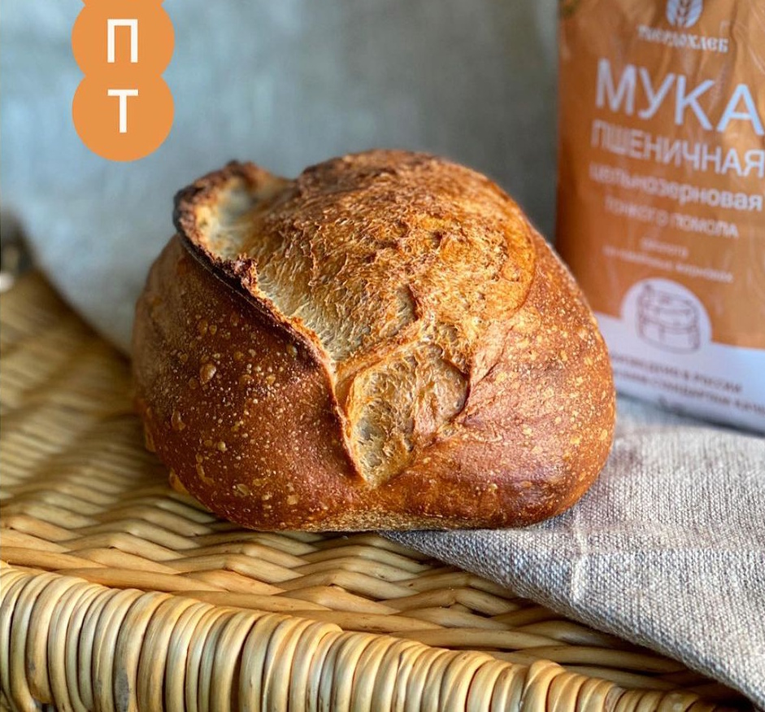

---
image: ../pics/celnozernovoi-100.jpg
---
# Цельнозерновой 100% на закваске

#### Ингредиенты:

* вода1 \(4-20С\) 340 г
* закваска пш 100% 100 г
* мука пшеничная цз 500 г 
* соль 12 г
* вода2 \(4-20С\) 60 г или меньше

#### Приготовление:

Соединить закваску с водой1. Добавить муку и месить 1-2 минуты до однородности. 

Дать отдохнуть тесту 30-60 минут для автолиза \(развития клейковины\). Далее добавить соль и воду 2 постепенно. Замесить тесто методом складываний. \(либо в тестомесе 3/3мин\). 

Оставить тесто для ферментации на 3-4 часа при температуре 22-26°C. При этом, через каждые 40 минут растянуть и сложить тесто \(Stretch & fold\). Всего 4 раза. Далее тесто бродит без складываний. 

Выбродившее тесто переложить на слегка подпыленный мукой стол. Деление пополам. Предварительное округление. Отлёжка 10-20 мин. Далее сформовать круглую или овальную тестозаготовку. 

Положить тестозаготовку швом вверх, и оставить подходить на 30-60 минут при комнатной температуре. Далее проводим расстойку в холодильнике в течение 12-18 ч при 4-8°C.

Перед отправкой в печь тестозаготовку можно не греть, а отправить сразу в печь. Перед посадкой в печь, сделать не глубокий \(до 1 см\) надрез лезвием или хлебным ножом. Выпекать в духовке, разогретой до 250°C, первые 10 минут с паром, затем уменьшить температуру до 240°C и выпекать еще 20-25 минут.

*ig: zabavnikov_ivan*
