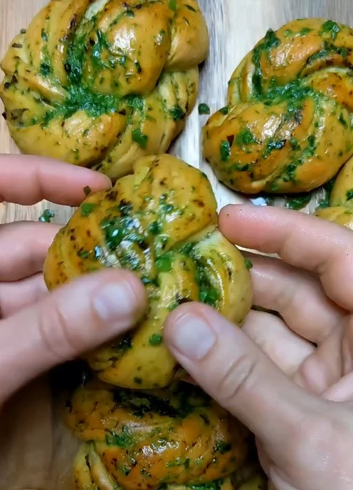

---
image: ../pics/cheremsha.jpg
---
# Узелки с черемшой

#### Ингредиенты

* мука 280 г
* вода 180 г
* сливочное масло 60 г
* соль 6 г
* сухие дрожжи 4,5 г

#### Приготовление

Сливочное масло растопить и слегка остудить. Замесить тесто, добавив в него столовую ложку масла (остальное сохранить) и столовую ложку измельчённой черемши. Оставить на час.

Сформировать узелки, выложить на противень, накрыть и оставить на 45 минут. 

Поставить в духовку, 200°, 15-20 минут. Первые минут 10 без конвекции.

Смешать оставшееся масло с парой ложек черемши и смазать горячие узелки.

*ig: thatchickenstock*
