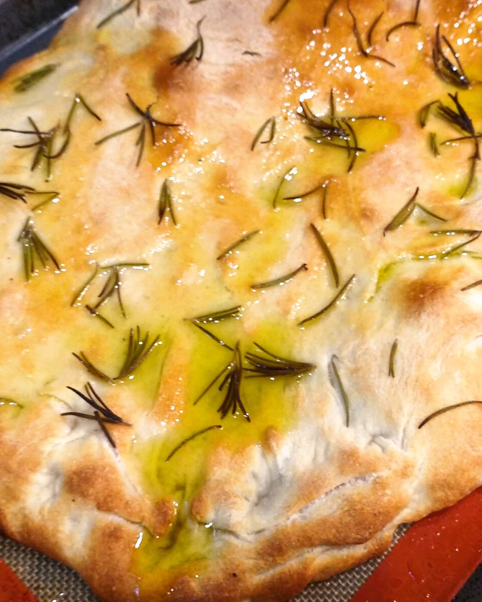

---
image: ../pics/focaccia.jpg
---
# Фокачча по рецепту Ришара Бертине

#### Ингредиенты:

на два противня 30\*40

* сильная мука 1 кг
* вода 720 г
* оливковое или другое вкусное масло 50 г + немного для смазывания
* свежие дрожжи  20 г \(или 7 г сухих\)
* семолина или полента 40 г \(можно использовать манку\)
* морская соль 20 г

#### Приготовление:

Смешать все ингредиенты в миксере, вымесить тесто около 12 минут.

Смазать миску маслом, поместить туда тесто и оставить на 1 час, накрыв тканью. Через час сложить тесто и оставить еще на час.

Выложить из миски на противень с силиконовым ковриком "вверх ногами", растянуть под размеры противня на весу руками, перевернуть так, чтобы верх был сверху. Посыпать розмарином или другими травами. Оставить расстаиваться еще на 45 минут, накрыв тканью.

Разогреть духовку до 220 С, выпекать примерно 20 минут до золотистой поверхности. Вынуть и сразу щедро полить маслом.

*ig: richardbertinet*

