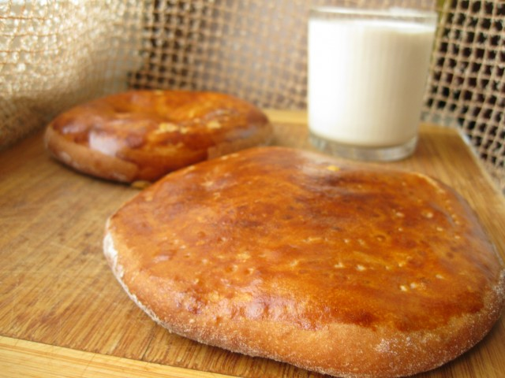

---
image: ../pics/gata-karabakhskaya.jpg
---
# Гата карабахская

#### Ингредиенты
на 6 штук

**для опары:**

* свежие дрожжи 10 г
* тёплая вода 120 г
* сильная мука 130 г

**для теста:**

* топленое масло 100 г
* сахар 100 г
* 1 яйцо
* соль 2 г
* сильная мука 260-300 г

**для начинки:**

* топлёное масло холодное 200 г
* сахарная пудра 150 г
* мука 260 г

**для смазывания:**

* сливочное масло 30-50 г
* 1 желток

#### Приготовление

В теплой воде развести дрожжи, всыпать просеянную муку и замесить опару. Поставить ее в теплое место, примерно на 30 минут.

Растопить масло, дать ему немного остыть. Яйца с сахаром слегка растереть, добавить в масло, добавить соль и хорошо перемешать.

Влить в опару яйца с сахаром и маслом, размешивая, постепенно всыпать еще муку. Тесто должно получиться средней густоты, но не слишком крутое. Поставить тесто подходить в тёплое место, пока оно увеличится почти вдвое.

Растереть масло, сахарную пудру и муку в крошку. Разделить начинку на 6 равных частей.

Тесто разделить на шесть колобков. Каждый раскатать в круг толщиной 0,5см, смазать его растопленным сливочным маслом. В центр положить начинку. Поднимая края лепёшки вверх, скрепить их. Затем выложить лепёшку швом вниз и раскатать её толщиной в 1,5 см. Уложить швом вниз на смазанный маслом противень. Нанести вилкой узоры, чуть прокалывая лепешку, смазать желтком.

Выпекать при 180 градусах 30 минут.

*lg: ais20*
