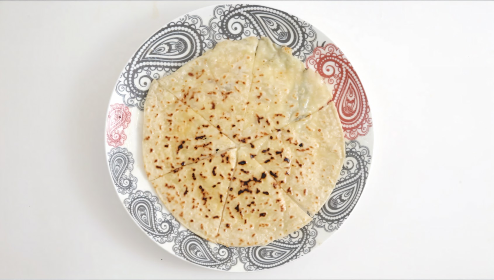

---
image: ../pics/hychini.jpg
---
# Хычины

#### Ингредиенты

* мука пшеничная цз тонкого помола 350 г
* айран 40 г
* вода 160 г
* соль 6 г
* водa2 10-20 г

**для начинки:**

* отварной картофель 200 г
* сыр сулугуни 160 г
* имеретинский сыр 40 г

#### Приготовление

Соединить все ингредиенты, замесить тесто. Вымешивать руками или в мисере 3-4 минуты до эластичности. Добавить воду2, если тесто получилось слишком плотным. Дать тесту отдохнуть 15–20 минут.

Пропустить через мясорубку отварной картофель и сыры.

Разделить тесто по 30-40 г, скатать каждую в шар, накрыть, оставить еще на 10–15 минут.

С помощью скалки раскатать тесто на присыпанной мукой поверхности в лепёшки толщиной в 1-2 мм. Взять один раскатанный блинчик, выложить на него начинку.
Накрыть сверху вторым блинчиком, слепить края и заново раскатать получившийся пирог в тонкий блин размером со сковородку диаметром порядка 30 см.

Выпекать на сковороде почти на максимальном огне по 60-90 секунд с каждой стороны.
Смазать тарелку топленым сливочным маслом, выложить хычин, также промазать сверху маслом. Разрезать на несколько куском-клиньев и подавать.

*ig: zabavnikov_ivan*
