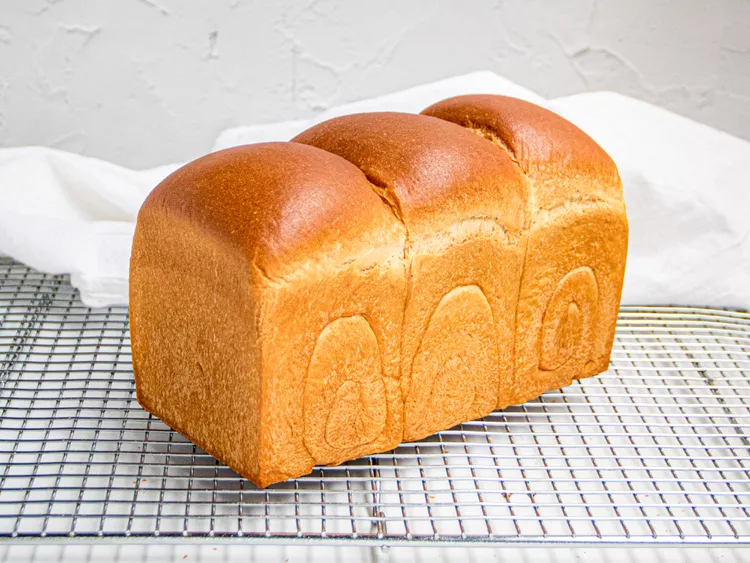

---
image: ../pics/jpn-bread.webp
---
# Японский хлеб

#### Ингредиенты

**для танг-жонг:**

* сильная мука 23 г
* вода 60 мл
* молоко 60 мл

**для теста:**

* танг-жонг
* теплое молоко 120 мл
* сухие дрожжи 7 г
* сахар 30 г
* чайная ложка соли
* сливочное масло 60 г
* сильная мука 350 г

#### Приготовление

Смешать муку, воду и молоко в кастрюльке, довести до кипения, перемешать до образования пасты. Накрыть пленкой так, чтобы пленка касалась пасты и дать остыть до комнатной температуры.

Развести дрожжи в молоке, добавить половину сахара, оставить в выключенной духовке до образования шапочки, минут на 10-15, в духовку поставить кружку с горячей водой.  
Добавить все остальные ингредиенты кроме масла, вымесить 5 минут.  
Добавить растопленное сливочное масло, вымесить 20 минут.  
Переложить тесто в смазанную маслом миску, прикрыть полотенцем, расстоять 2-2,5 часа, раз в час обминая.  
Оставить в холодильнике на 2 часа или на ночь.  

Охлажденное тесто разделить на 4 равные части.  
Скалкой раскатать в овальные лепешки размером 10-15 см. Завернуть с коротких сторон к центру, а после с длиной стороны свернуть в рулетик. Уложить в форму на шов рулетики вплотную друг к другу. Отправить на расстойку на 2 часа.  
Перед выпечкой смазать смесью желтка и воды, отправить в разогретую на 180 духовку минут на 35. Минут через 15 прикрыть фольгой.  

*tg: sestrytokarevy*
