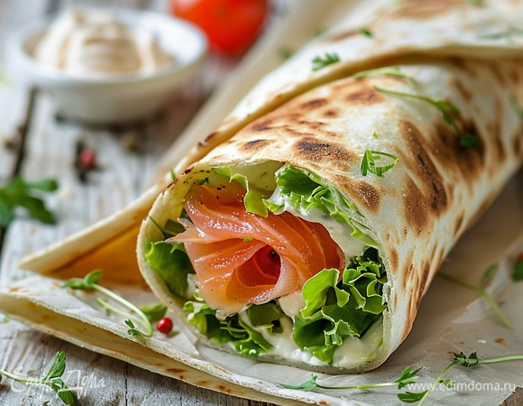

---
image: ../pics/lavash.jpg
---
# Цельнозерновой лаваш

#### Ингредиенты
на 8 лепешек

* вода 180 г
* пшеничная мука цз 350 г
* соль 6 г
* оливковое масло 15 г
* вода2 10-20 г

#### Приготовление

Замесить всё, кроме воды2, руками или миксером 3–4 минуты до эластичного состояния. Добавить воду2, если тесто получилось слишком плотным. Дать тесту отдохнуть 15–20 минут.

Разделить на 8 частей, скатать в шарики, накрыть, оставить еще на 10–15 минут.

Раскатать на присыпанной мукой поверхности в лепёшки толщиной 1–2 мм.

Выпекать на сковороде по 60–90 сек с каждой стороны (почти макс. огонь) или в духовке на максимальном жару.

*ig: zabavnikov_ivan*

