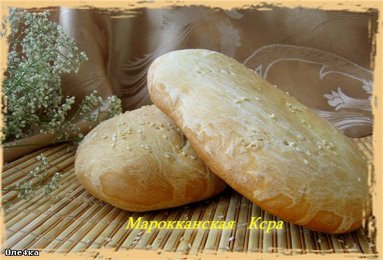

---
image: ../pics/marokkanskaya-ksra.jpg
---
# Марокканская Ксра

#### Ингредиенты

* вода 200 мл
* сильная муки 250 г
* манка 75 г
* анисовая настойка 5 мл
* соль 1 1/2 ч л
* сахар 1/2 ч л
* сухие дрожжи 1 ч л 
* оливковое масло 
* кунжутные семечки для посыпки

#### Приготовление

Развести дрожжи в маленьком количестве воды с сахаром и смешать с остальными продуктами. Вымесить тесто. 

Разделить тесто на две или четыре части, скатать шарики и руками размять в лепешки, толщиной примерно 2 см. Переложить на противень. 

Покрыть пленкой смазанной маслом и дать подойти в течении 30 минут или пока лепешки не увеличатся. 

Нагреть духовку до 200С. Смазать каждую лепешку оливковым маслом, посыпать кунжутными семечками и наколоть лепешки вилкой. Печь 20-25 минут или до золотистого цвета. Лепешки при постукивании по ним пальцами должны издавать "пустой" звук.

*lg: world-cuisine*
