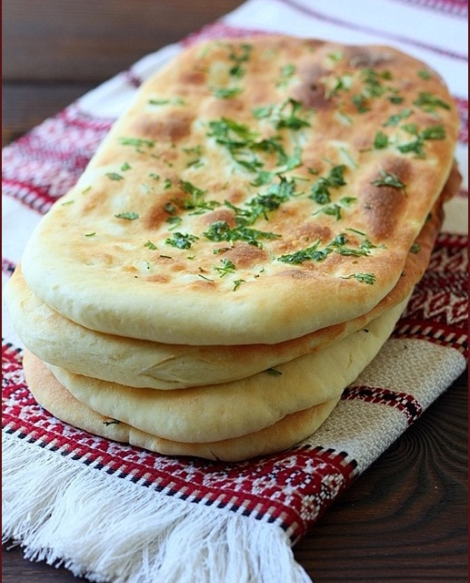

---
image: ../pics/naan.jpg
---
# Naan - индийские лепешки

#### Ингредиенты
на 8 лепешек

* сильная мука 360 г
* разрыхлитель 1 ч л
* соль 1/2 ч л 
* натуральный йогурт 160 г
* 1 взбитое венчиком яйцо
* топленое масло 2 ст л
* теплое молоко 160 г
* сухие дрожжи 18 г
* сахар 2 ст л
* зелень мелко-рубленая
* топленое масло для смазки

#### Приготовление

Дрожжи, сахар и молоко, смешать вместе и оставить на 20 минут.

Муку просеять вместе с пекарским порошком, солью,в середине сделать углубление, добавить поднявшиеся дрожжи, добавить йогурт, топленое масло, яйцо, замесить тесто.

Смазать чашку и тесто топленым маслом, прикрыть полотенцем, оставить на 2 часа в теплом месте. После стол обильно посыпать мукой, вымесить тесто около 5 минут. Разделить тесто на 8 равных частей, каждую часть скатать в шар, каждый шар раскатать в круг, после руками, вытягивая тесто придать ему форму овала, так поступить с каждой лепешкой.

Противень смазать топленым маслом, положить лепешки, сверху кисточкой помазать каждую лепешку топленым маслом, посыпать рубленой зеленью.

Выпекать в разогретой духовке при температуре 250 градусов, примерно 10-15 минут, до того как лепешки станут светло-золотистого цвета

*lg: elena-fialka*
