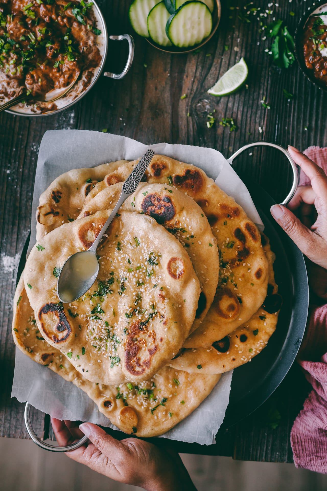

# Naan - индийские лепешки

#### Ингредиенты
на 8 лепешек

* мука 130 г
* мука цз 130 г
* сода 1 ч л
* растительное масло 15 г
* натуральный йогурт 250 г
* соль
* зелень мелко-рубленая
* кунжут
* топленое масло

#### Приготовление

Муку смешать с содой и солью, в середине сделать углубление, влить йогурт и растительное масло, замесить тесто. Если тесто слишком сухое, добавить воды. Смазать чашку и тесто маслом, прикрыть полотенцем, оставить отдохнуть на 15 минут. 

Скатать в тесто в рулет, разделить на 8 частей. Прикрыть полотенцем и не открывать пока работаем с одной лепешкой. Разогреть плоскую сковороду на среднем огне, приготовить крышку.

Раскатать диск в произвольную форму, присыпая мукой, присыпать кинзой и кунжутом, прижимая к тесту. Перевернуть диск и смазать водой обратную сторону. 

Выложить на разогретую сковороду влажной стороной вниз и сразу накрыть крышкой. Подождать 30-40 сек пока лепешка поднимается, затем открыть крышку, смазать топленым маслом, перевернуть лепешку, обжарить еще 30 сек. Снять на тарелку и прикрыть фольгой.

Подавать горячими к карри.

*playfulcooking.com*
