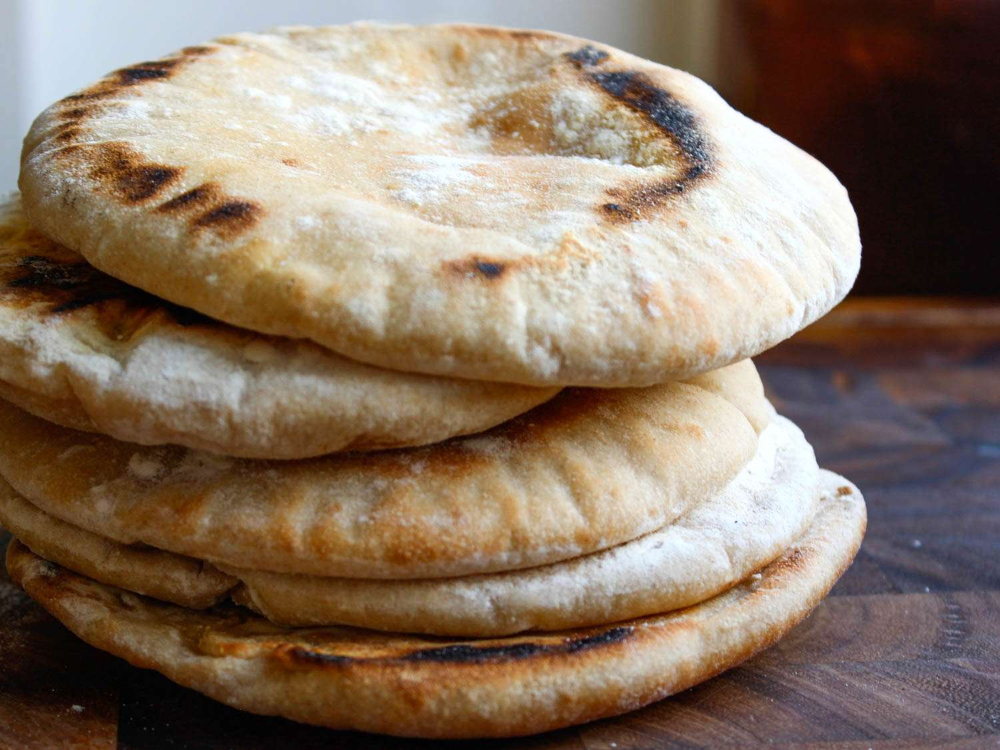

---
image: ../pics/pita.jpg
---
# Пита

#### Ингредиенты
на 6 штук

* вода 150 г
* закваска пшеничная 100% 100 г
* пшеничная мука 280 г
* пшеничная мука цз 30 г
* соль 6 г
* растительное масло 20 г

#### Приготовление

Закваску размешать в воде. Добавить все оставшиеся ингридиенты и замешать  тесто. Вымешивать руками 5-8 минут. Брожение при комнатной температуре 60-90 минут.

Разделить на 6 частей, скатать в шарики, накрыть, оставить еще на 10–15 минут.

Раскатать на присыпанной мукой поверхности в питы толщиной 4-5мм.

Питы выпекать в духовке на камне или противне на максимальном жаре 2-3 минуты.

*ig: zabavnikov_ivan*

