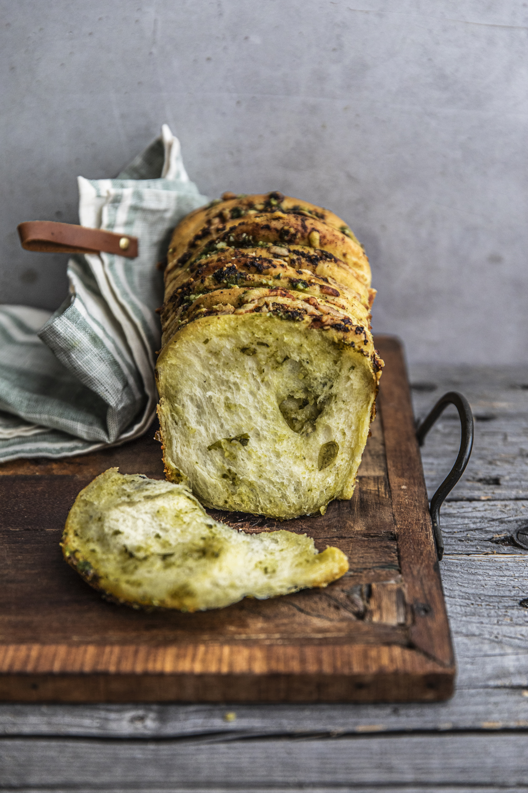

# Отрывной хлеб с базиликом, сыром и песто (Pull Apart Bread al basilico con formaggio e pesto)

#### Ингредиенты
на 1 форму для кекса (20×10 см)

* Пшеничная мука 200 г
* Мука Манитоба (Manitoba Cream) 100 г
* Свежие дрожжи 12.5 г
* Сахар 5 г
* Цельное свежее молоко 125 г
* Куриное яйцо 50 г
* Чеснок (по желанию) 5 г
* Сливочное масло 40 г
* Соль 5 г
* Песто из базилика 250 г
* Моцарелла 125 г
* Тёртый сыр Грана Падано 100 г

#### Приготовление

Насыпать пшеничную муку и муку Манитоба в чашу миксера. Сделать углубление в центре, крошить свежие дрожжи, добавить сахар и влить теплое молоко. Накрыть полотенцем и оставить смесь на 5–10 минут. 

Начать замешивать тесто насадкой «крюк» или вручную. Добавить куриное яйцо и измельченный чеснок без сердцевины. Ввести размягченное сливочное масло и соль. Вымешивать тесто до полного впитывания масла и получения гладкой структуры. Сформировать из теста шар, переложить в смазанную маслом емкость, накрыть пищевой пленкой и оставить подниматься в теплом месте на 60–90 минут до увеличения в объеме в 2 раза. 

Смазать маслом форму для кекса размером 20×10 см. Обмять тесто, выложить на рабочий стол и разделить на 12 равных частей. Раскатать каждый кусочек в овальную лепёшку диаметром около 10 см. Выложить на каждую лепёшку 1–2 чайные ложки песто, ломтик моцареллы и немного тёртого сыра Грана Падано. Сложить лепёшки пополам и плотно уложить их в форму срезом вверх. Оставить тесто для повторного подъема в теплом месте на 45 минут. 

Разогреть духовку до 200 °C в статическом режиме. Выпекать хлеб в средней части духовки 10 минут. Уменьшить температуру до 180 °C и выпекать еще 20 минут. Достать форму из духовки и смазать горячий хлеб оставшимися 50 г песто. Остудить хлеб в форме в течение 10 минут, затем извлечь и подавать.

*rossellavenezia.com*

