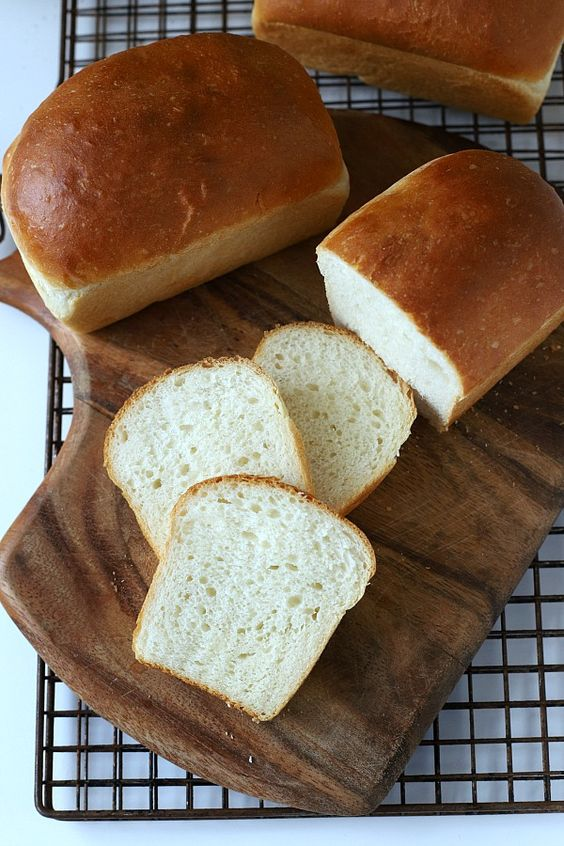

---
image: ../pics/quick-potato-bread.jpg
---
# Быстрый картофельный хлеб

#### Ингредиенты:

* 800 г картошки
* 1 кг муки
* 20 г дрожжей
* 600 мл молока
* 20 г соли

#### Приготовление:

Картошку отварить, размять, ОСТУДИТЬ (главное — не добавлять в тесто горячее пюре, чтобы дрожжи не убило). Готовый картофель замесить с мукой, дрожжами, солью и молоком. Расстоять 2.5-3 часа. Выпечь

*tg: feedthebitch*

