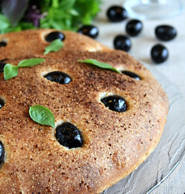
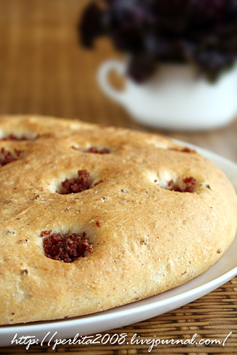
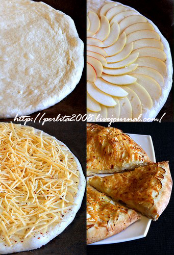

---
image: ../pics/semolina-lepeshka.jpg
---
# Манные лепешки с начинкой

#### Ингредиенты

* сухие дрожжи 1 ч л
* соль 1,5 ч л
* сахар 1,5 ст л
* сильная мука 200 г
* манка 100 г
* растительное масло 1 ст л
* вода 220 мл

#### Приготовление

Развести дрожжи в маленьком количестве воды с сахаром и смешать с остальными продуктами. Вымесить тесто в течение получаса, тесто должно получиться не плотное, вынимать смазанными маслом руками. 

На противне, застеленном бумагой, сформировать лепешку. Оставить в теплом месте на 30 минут, сделать углубления и выложить начинку. Выпекать в разогретой до 200 градусов духовке в течении 15-20 минут или до готовности

### Лепешка с оливками и базиликом

#### Ингредиенты

* 1 горсть оливок 
* сушеный базилик 1 ст л
 
### Лепешка с семгой и укропом

#### Ингредиенты

* подкопченная семга 150 г 
* сушеный укроп

### Лепешка с салями

#### Ингредиенты

* салями 50 г

### Лепешка с яблоками и сыром

#### Ингредиенты

* 1-2 яблока 
* сыр 125 г
* красный молотый перец

*lg: laperla-foto*
