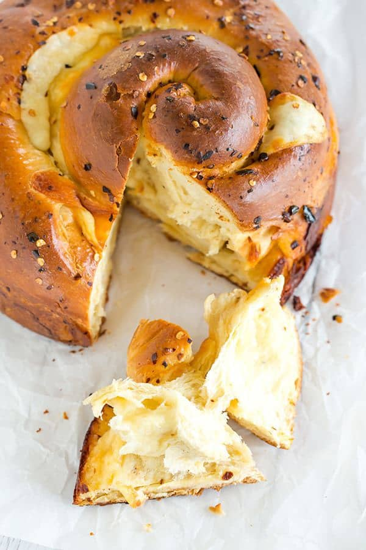

---
image: ../pics/spicy-cheese-bread.jpg
---
# Spicy Cheese Bread \| Пряный сырный хлеб

#### Ингредиенты:

на форму 22 см

* пшеничная мука 400 г
* сахар 50 г
* сухие дрожжи 1 ст л
* хлопья красного перца 1,5 ч л
* соль 1¼ ч л
* теплая вода (40C) 125 мл
* 2 яйца
* 1 яичный желток
* сливочное масло 45 г
* полутвердый сыр 170 г
* сыр проволоне или моцарелла 170 г
  
**для топпинга:**
* 1 яйцо
* хлопья красного перца 1 ч л
* сливочное масло 1 ст л

#### Приготовление:

В чаше стационарного миксера смешать муку, сахар, дрожжи, хлопья красного перца и соль. В мерном стакане для жидкости смешать теплую воду, яйца, яичный желток и растопленное сливочное масло. Добавьте яичную смесь к мучной смеси в миске, вымесить 4-8 минут.

Сформировать из теста шар и переложить в смазанную маслом миску, расстоять 1,5–2 часа.

Раскатать тесто в прямоугольник, распределить сыр, нарезанных кубиками, оставляя 1-дюймовую границу по краям. Свернуть в рулет, защипнуть, раскатать в длину, свернуть в улитку.
Выложить в смазанную маслом форму и расстоять 1–1,5 часа.

Разогреть духовку до 190С.

Смазать верх буханки взбитым яйцом, посыпать хлопьями красного перца. Выпекать 25 минут до золотистого цвета. Затем накрыть фольгой и выпечь еще 25-30 минут.

Вынуть и сразу смазать размягченным сливочным маслом. Остудить в форме 10 минут, затем 30 мин на решетке.

*browneyedbaker.com*
