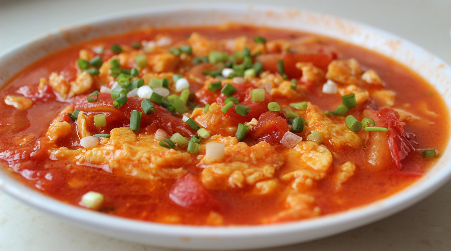

---
image: ../pics/chinese-egg.jpg
---
# Жареные яйца с помидорами (西红柿炒蛋)

#### Ингредиенты

* 4 яйца
* 2 спелых средних помидора
* вода 2-3 ст л
* сахар 1/3 ч л
* поварское вино 1 ст л
* кунжутное масло 0,5 ч л
* устричный соус 1 ч л
* кунжут
* соль, перец по вкусу
* растительное масло для жарки

* чесночный порошок
* соевый соус
* крахмал разведенный водой (для сгущения соуса)
* белый рисовый уксус
* сушеный молотый чили перец
* молотый сычуанский перец
* острое масло чили
* рыбный соус

#### Приготовление

Взбить яйца, тонкими дольками порезать помидоры. 

Разогреть масло на сковороде, пожарить яйца до готовности, но не дать подрумяниться, достать из сковородки, отложить. 

Опять разогреть масло, выложить помидоры в сковороду, подсолить чтобы помидоры пустили сок, всыпать сахар, он убирает кислинку помидора, через пару минут налить 2-3 столовые ложки воды, можно чуть больше (если помидоры не очень сочные). Если помидоры "пластиковые", при жарке можно добавить столовую ложку томатной пасты.

Еще через пару минут выложить яйца обратно в сковородку, хорошенько все перемешать, налить шаосинское (поварское) вино, устричный соус, кунжутное масло, поперчить, посолить по вкусу и через 30 секунд выключить сковородку.

*lg: sigute_di*